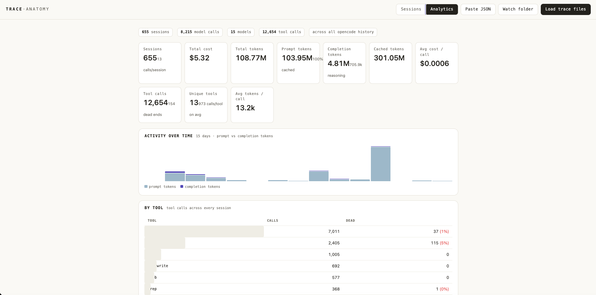

# trace-trek

<p align="center">
  
</p>

Monorepo for the opencode self-improvement loop: collect agent traces, visualize them, build datasets, train models, evaluate, and deploy.

## Structure

```
trace-trek/
├── viewer/                          # Trace visualization (Vite + React)
│   ├── src/                         # React app (anatomy view, dashboard, eval tab)
│   ├── server/                      # Vite middleware: DB access, SFT export, HF upload
│   └── vite.config.js
│
├── pipeline/                        # Self-improvement loop
│   ├── collect/                     # proxy.py, replay.py, pull_cursor.py, task generators
│   ├── dataset/                     # build_dataset.py, split_tasks.py, *.jsonl task files
│   ├── train/                       # QLoRA training (Unsloth/TRL+PEFT)
│   ├── eval/                        # Evaluation runners, agent comparison, HTML embed
│   ├── inference/                   # MLX and Modal serving scripts
│   ├── deploy/                      # GGUF conversion + llama-server swap
│   ├── raw/                         # Collected traces (gitignored)
│   ├── Makefile
│   └── README.md                    # Full pipeline docs
│
├── menubar/                         # macOS menu bar tracker for the viewer dev server
├── scripts/                         # Utility scripts (harvest-harness, upload-to-hf)
├── review                           # CLI for snapshotting/reviewing file changes
├── opencode.json                    # opencode agent config
└── .env                             # API keys
```

## Quick start

### Viewer (trace visualization + data export)

```bash
cd viewer
npm install
npm run dev          # opens Vite dev server at localhost:5173
```

The viewer connects to opencode's SQLite DB and can export sessions as SFT
training data and upload them directly to HuggingFace.


### Pipeline (pull dataset → train → eval → deploy)

Data is collected from opencode's DB via the viewer, pushed to HuggingFace,
then pulled by the training pipeline. See `pipeline/README.md` for full docs.

```bash
cd pipeline

# 1. Pull the latest dataset from HF and train
make train

# 2. Deploy
./deploy/deploy.sh /path/to/merged-checkpoint v2

# 3. Evaluate
make eval
make eval-tasks
```

### End-to-end flow

```
opencode SQLite DB  ──>  viewer app  ──>  HuggingFace  ──>  train.py --hf-repo
                (export SFT)       (upload)           (QLoRA on cloud GPU)
```

## Key integrations

- **viewer ↔ pipeline:** `viewer/server/filter.js` shells out to `pipeline/dataset/build_dataset.py` for the quality gate when exporting SFT data.
- **viewer → opencode DB:** The dev server connects to opencode's SQLite DB for session listing and analytics.
- **pipeline → HF:** SFT datasets can be uploaded to Hugging Face via the viewer's UI or `scripts/upload_to_hf.py`.
